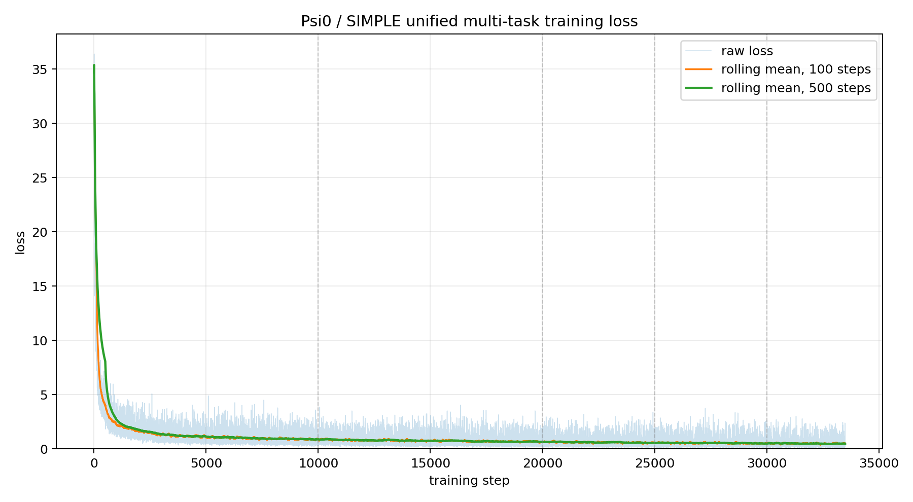
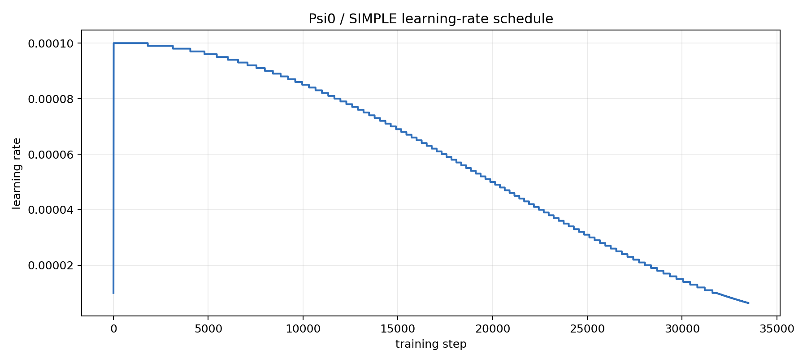
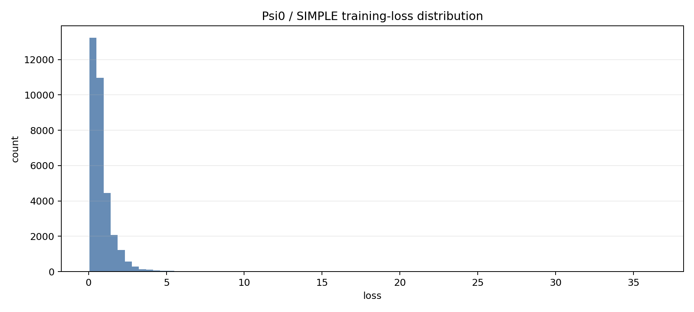

# 组会汇报速览：SIMPLE / DexJoCo 多任务 Baseline 实验

更新时间：2026-07-14

## 一句话结论

目前已经完成 SIMPLE 和 DexJoCo 的多任务 baseline 数据准备与自动化归档，并启动了第一个完整训练单元：Psi0 在 SIMPLE 17 个任务上的统一多任务训练。该训练已经通过 smoke test；根据最新解析的训练日志，full run 已到 step 33,495 / 40,000，约 83.74%。目前这仍属于训练进度结果，最终 benchmark 分数需要等 40k 训练完成后再做仿真 rollout 评测。

## 当前可汇报进展

| 模块 | 状态 | 说明 |
|---|---|---|
| SIMPLE 数据 | 已准备 | 17 个 canonical humanoid tasks，540,664 training samples |
| DexJoCo 数据 | 已归一化 | 11 tasks，1,100 episodes，523,763 frames |
| Psi0 / SIMPLE smoke | 已通过 | 20 / 20 steps，smoke validation loss 27.34775 |
| Psi0 / SIMPLE full | 运行中 | 最新日志解析到 33,495 / 40,000 steps |
| ACT / SIMPLE | 已排队 | 等 Psi0 full run 完成后自动启动 |
| Diffusion Policy / SIMPLE | 已排队 | 等 ACT 后自动启动 |
| ABot-M0.5 | blocked | 官方代码和权重未发布，不能用 ABot-M0 替代 |
| GitHub 归档 | 已推送 | Draft PR: https://github.com/yky666/humanoid_robot_long_horizon_tasks/pull/1 |

所有可报告结果都遵循统一规则：每个 benchmark 上只能报告“一个 checkpoint 训练全部任务”的结果，不能使用单任务训练结果替代。

## 训练曲线与指标

### Psi0 / SIMPLE loss 曲线

### Psi0 / SIMPLE learning-rate 曲线

### Psi0 / SIMPLE loss 分布

### 解析得到的关键数值

| 指标 | 当前值 |
|---|---:|
| logged steps | 33,495 |
| latest step | 33,495 / 40,000 |
| computed progress | 83.74% |
| latest loss | 0.336 |
| latest lr | 6.4e-06 |
| min loss | 0.0606 |
| max loss | 36.4 |
| mean loss | 0.9123 |
| median loss | 0.619 |
| last 100 mean loss | 0.4793 |
| last 500 mean loss | 0.4760 |
| observed checkpoints | 10k, 20k, 25k, 30k |

相关数据文件：

- [psi0_simple_training_summary.json](artifacts/psi0_simple/psi0_simple_training_summary.json)
- [psi0_simple_training_metrics.csv](artifacts/psi0_simple/psi0_simple_training_metrics.csv)
- [psi0_simple_training_metrics_with_rolling.csv](artifacts/psi0_simple/psi0_simple_training_metrics_with_rolling.csv)

说明：这些指标从远端 `psi0_simple_full.log` 中解析得到。远端 W&B 当前是 offline run，因此本次仓库中保留解析后的曲线和表格，避免依赖在线 W&B 页面。

## W&B media 样本

远端 W&B offline run 中有约 236MB raw image media。为了避免仓库膨胀，这里只保留 4 张代表性样本图，分别来自不同训练阶段：

| 阶段 | 样本 |
|---|---|
| step 0 | [raw_images_0](artifacts/psi0_simple/wandb_media_samples/raw_images_0_dca28c13c4bab801c6a8.png) |
| step 10099 | [raw_images_10099](artifacts/psi0_simple/wandb_media_samples/raw_images_10099_970f1d5b337d8ef1e6e9.png) |
| step 20099 | [raw_images_20099](artifacts/psi0_simple/wandb_media_samples/raw_images_20099_3f2573ae8cb1032a758b.png) |
| step 30099 | [raw_images_30099](artifacts/psi0_simple/wandb_media_samples/raw_images_30099_f1bca90fbb0dded36f7f.png) |

## 数据准备情况

### SIMPLE

SIMPLE 当前使用 17 个任务做统一多任务训练：

| # | Task |
|---:|---|
| 1 | G1WholebodyBendHandoverTeleop-v0 |
| 2 | G1WholebodyBendPickAndPlaceTeleop-v0 |
| 3 | G1WholebodyBendPickMP-v0 |
| 4 | G1WholebodyBendPickSimToRealTeleop-v0 |
| 5 | G1WholebodyBendPickTeleop-v0 |
| 6 | G1WholebodyCloseDoorTeleop-v0 |
| 7 | G1WholebodyHandoverTeleop-v0 |
| 8 | G1WholebodyLocomotionPickBetweenTablesTeleop-v0 |
| 9 | G1WholebodyOpenFaucetTeleop-v0 |
| 10 | G1WholebodyOpenOvenTeleop-v0 |
| 11 | G1WholebodyOpenTrashCanTeleop-v0 |
| 12 | G1WholebodyPickAndPlaceAndHugContainerTeleop-v0 |
| 13 | G1WholebodyPushOfficeChairTeleop-v0 |
| 14 | G1WholebodyTabletopGraspMP-v0 |
| 15 | G1WholebodyXMoveBendPickMP-v0 |
| 16 | G1WholebodyXMoveBendPickTeleop-v0 |
| 17 | G1WholebodyXMovePickTeleop-v0 |

### DexJoCo

DexJoCo 已归一化到统一 schema：

- action dimension: 44
- state dimension: 46
- 单臂任务 padding / mask 到统一维度
- 单腕相机流同时映射到 left/right wrist camera slot

| Task | Episodes | Frames | Source dims |
|---|---:|---:|---|
| bimanual_assembly | 100 | 54,170 | action 44 / state 46 |
| bimanual_hanoi | 100 | 107,321 | action 44 / state 46 |
| bimanual_microwave_cook | 100 | 68,364 | action 44 / state 46 |
| bimanual_photograph | 100 | 34,278 | action 44 / state 46 |
| bimanual_unlock_ipad | 100 | 40,637 | action 44 / state 46 |
| click_mouse | 100 | 32,680 | action 22 / state 23, padded |
| fold_glasses | 100 | 53,632 | action 22 / state 23, padded |
| hammer_nail | 100 | 21,571 | action 22 / state 23, padded |
| pick_bucket | 100 | 43,300 | action 22 / state 23, padded |
| pinch_tongs | 100 | 40,065 | action 22 / state 23, padded |
| water_plant | 100 | 27,745 | action 22 / state 23, padded |

## 组会建议表述

可以强调：

1. 实验协议已经固定：所有 baseline 都采用统一多任务训练，避免单任务训练带来的不公平比较。
2. SIMPLE 和 DexJoCo 的数据准备已经完成，DexJoCo 的单臂/双臂异构数据已统一 schema。
3. 第一个 full baseline，Psi0/SIMPLE，已跑到约 84%，中途没有因为 OOM 或 NaN 终止。
4. 训练曲线、CSV 指标、W&B media 样本和归档文件已经整理并准备推送到 GitHub。

不要过度表述：

- 不要说全部 baseline 已完成；目前是 Psi0/SIMPLE full run 在进行中。
- 不要给最终 success rate；仿真 rollout 评测尚未完成。
- 不要把 smoke test loss 当作最终性能指标。
- 不要用 ABot-M0 替代 ABot-M0.5。

## 下一步

| 优先级 | 动作 | 目标 |
|---:|---|---|
| 1 | 等 Psi0/SIMPLE 跑完 40k | 得到首个完整多任务 checkpoint |
| 2 | 归档 Psi0/SIMPLE final run | 更新日志、曲线、CSV、summary |
| 3 | 对 Psi0/SIMPLE 做仿真 rollout | 形成第一行正式 benchmark 指标 |
| 4 | 启动 ACT 和 Diffusion Policy 队列 | 补齐 classical policy baseline |
| 5 | 启动 DexJoCo smoke test | 验证 44-D / 46-D schema 对各模型可用 |
| 6 | 适配 pi0.5 / RLDX-1 / EgoVLA / GR00T | 扩展完整模型矩阵 |

## 证据路径

远端：

- `/HOME/sysu_xdliang/sysu_xdliang_1/HDD_POOL/Humanoid/yangky/baseline_experiments/logs/psi0_simple_full.log`
- `/HOME/sysu_xdliang/sysu_xdliang_1/HDD_POOL/Humanoid/yangky/baseline_experiments/archives/2026-07-13T16-50-12Z`
- `/HOME/sysu_xdliang/sysu_xdliang_1/HDD_POOL/Humanoid/yangky/Psi0/.runs/finetune/simple-multitask-psi0.simple.flow1000.cosine.lr1.0e-04.b16.gpus1.2607131150/wandb`

GitHub：

- https://github.com/yky666/humanoid_robot_long_horizon_tasks/pull/1
