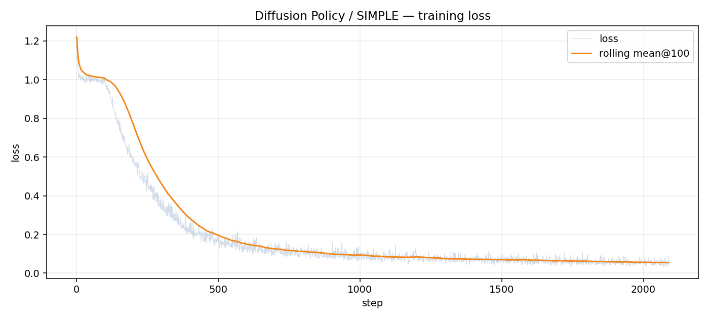
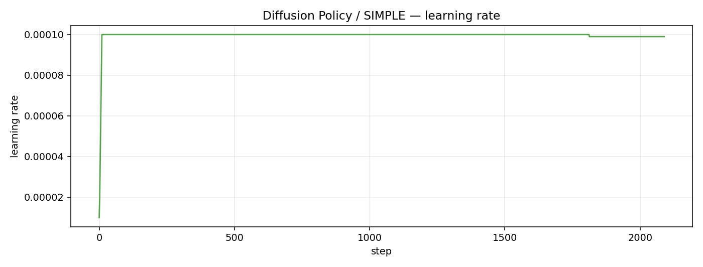
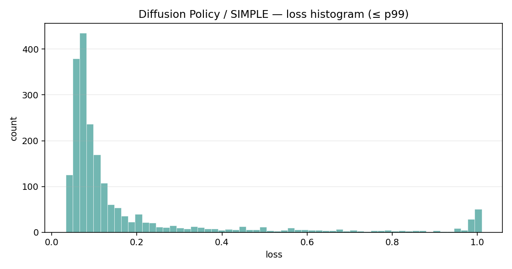

# 组会汇报速览：SIMPLE / DexJoCo 多任务 Baseline 实验

更新时间：2026-07-13 22:19 UTC

## 一句话结论

Psi0 / SIMPLE 多任务 full 训练已完成（40000/40000），最终 train loss≈0.375。 Diffusion Policy / SIMPLE full 正在跑（2089/40000，约 5.22%）。 当前仍是训练指标；正式 success rate 需等 SIMPLE 仿真闭环 rollout。

## 当前可汇报进展

| 模块 | 状态 | 说明 |
|---|---|---|
| SIMPLE 数据 | 已准备 | 17 canonical tasks，540,664 training samples |
| DexJoCo 数据 | 已归一化 | 11 tasks，1,100 episodes，523,763 frames |
| Psi0 / SIMPLE full | full_complete | 40000 / 40000，loss=0.375，ckpt=[5000, 10000, 15000, 20000, 25000, 30000, 35000, 40000] |
| Diffusion Policy / SIMPLE | full_running | 2089 / 40000，loss=0.0931 |
| ACT / SIMPLE | smoke_failed | ResNet18 权重已缓存；等 DP 完成后自动重跑 |
| ABot-M0.5 | blocked | 官方代码/权重未发布 |
| Demo 视频库 | 已保存 | `videos/demo_gallery`：SIMPLE 17 + DexJoCo 11；另有 `SIMPLE_longest` |
| SIMPLE 仿真安装 | install_failed | 节点 DNS 不可用，闭环 rollout 暂缓 |

## 训练曲线与指标

### Psi0 / SIMPLE

| 指标 | 值 |
|---|---:|
| latest step | 40000 / 40000 |
| progress | 100.0% |
| latest loss | 0.375 |
| latest lr | 0.0 |
| min / max / mean / median loss | 0.0527 / 36.4 / 0.8369 / 0.563 |
| last100 / last500 mean loss | 0.4474 / 0.434 |
| checkpoints | 5000, 10000, 15000, 20000, 25000, 30000, 35000, 40000 |

- [psi0_simple_training_summary.json](artifacts/psi0_simple/psi0_simple_training_summary.json)
- [psi0_simple_training_metrics.csv](artifacts/psi0_simple/psi0_simple_training_metrics.csv)

### Diffusion Policy / SIMPLE

| 指标 | 值 |
|---|---:|
| latest step | 2089 / 40000 |
| progress | 5.22% |
| latest loss | 0.0931 |
| latest lr | 9.9e-05 |
| min / max / mean / median loss | 0.0327 / 1.22 / 0.1934 / 0.0874 |
| last100 / last500 mean loss | 0.0548 / 0.0589 |
| checkpoints |  |

- [diffusion_policy_simple_training_summary.json](artifacts/diffusion_policy_simple/diffusion_policy_simple_training_summary.json)
- [diffusion_policy_simple_training_metrics.csv](artifacts/diffusion_policy_simple/diffusion_policy_simple_training_metrics.csv)

## 说明

- 指标来自远端 tqdm 训练日志解析；W&B 多为 offline。
- 报告值仅为 train loss / lr / progress，不是仿真 success rate。
- 闭环 rollout 视频需先恢复节点 DNS 或离线安装 SIMPLE/IsaacSim。

## 证据路径

- `/HOME/sysu_xdliang/sysu_xdliang_1/HDD_POOL/Humanoid/yangky/baseline_experiments/logs`
- `/HOME/sysu_xdliang/sysu_xdliang_1/HDD_POOL/Humanoid/yangky/baseline_experiments/meeting_summary/artifacts`
- `/HOME/sysu_xdliang/sysu_xdliang_1/HDD_POOL/Humanoid/yangky/baseline_experiments/videos/demo_gallery`
