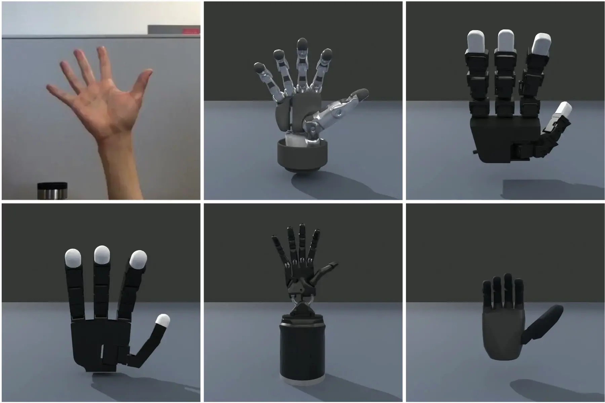
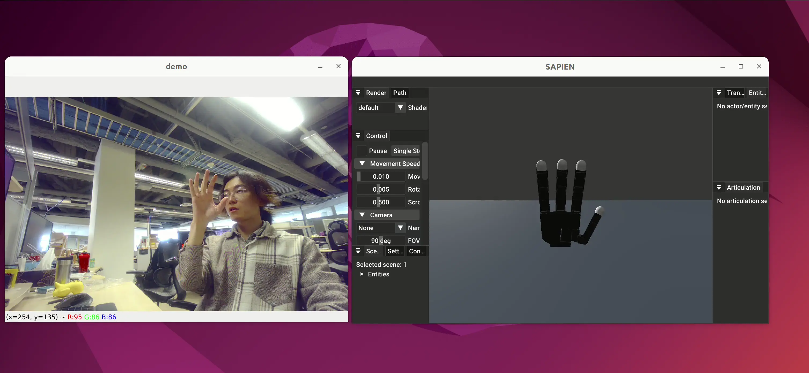

## Retarget Robot Motion from Human Hand Video



### Generate the robot joint pose trajectory from our pre-recorded video

```shell
cd example/vector_retargeting
python3 detect_from_video.py \
  --robot-name allegro \
  --video-path data/human_hand_video.mp4 \
  --retargeting-type dexpilot \
  --hand-type right \
  --output-path data/allegro_joints.pkl 
```

This command will output the joint trajectory as a pickle file at the `output_path`.

The pickle file is a python dictionary with two keys: `meta_data` and `data`. `meta_data`, a dictionary, includes
details about the robot, while `data`, a list, contains the robotic joint positions for each frame. For additional
options, refer to the help information. Note that the time cost here includes both the hand pose detection from video,
and the hand pose retargeting in single process mode.

```shell
python3 detect_from_video.py --help
```

### Utilize the pickle file to produce a video of the robot

```shell
python3 render_robot_hand.py \
  --pickle-path data/allegro_joints.pkl \
  --output-video-path data/allegro.mp4 \
  --headless
```

This command uses the data saved from the previous step to create a rendered video.

### Capture a Video Using Your Webcam

*The following instructions assume that your computer has a webcam connected.*

```bash
python3 capture_webcam.py --video-path data/my_human_hand_video.mp4
```

This command enables you to use your webcam to record a video saved in MP4 format. To stop recording, press `Esc` on your
keyboard.

### Real-time Visualization of Hand Retargeting via Webcam

```bash
pip install loguru
python3 show_realtime_retargeting.py \
  --robot-name allegro \
  --retargeting-type dexpilot \
  --hand-type right 
```

This process integrates the tasks described above. It involves capturing your hand movements through the webcam and
instantaneously displaying the retargeting outcomes in the SAPIEN viewer. Special thanks
to [@xbkaishui](https://github.com/xbkaishui) for contributing the initial pull request.

### RH56DFTP 3D Preview Only

If you only want the RF56 3D model in the browser preview and do not want to touch the real hand yet, run the
realtime demo without `--publish-to-inspire-sdk`.

```bash
cd example/vector_retargeting
python3 show_realtime_retargeting.py \
  --robot-name rh56dftp \
  --retargeting-type vector \
  --hand-type right \
  --camera-path http://127.0.0.1:18000/video
```

For left-hand preview, only change `--hand-type left`. This still uses the RF56 URDF and retargeting config, but it
does not open the SDK DDS command path.

If your camera stream is mirrored like a selfie preview, add `--selfie` so MediaPipe hand labels line up with the
actual left/right hand you are showing.

### RH56DFTP Inspire SDK Direct Control

If you want to drive the real hand through the Inspire SDK, use a merged Python environment that contains both
`dex-retargeting` and the local SDK workspaces.

```bash
conda create -n dex_inspire python=3.10 -y
conda activate dex_inspire
pip install -e /home/sys01/yangky/test/nlp225/260416/inspire_hand_ws/unitree_sdk2_python
pip install -e /home/sys01/yangky/test/nlp225/260416/inspire_hand_ws/inspire_hand_sdk
pip install -e "/home/sys01/yangky/test/dex-retargeting[example]"
```

Step 1 starts the headless SDK driver. It subscribes to `rt/inspire_hand/ctrl/r` or `rt/inspire_hand/ctrl/l` and
writes those commands to the physical hand over Modbus TCP or serial.

```bash
cd example/vector_retargeting
python3 start_inspire_hand_driver.py \
  --hand-type right \
  --ip 192.168.123.210 \
  --device-id 1
```

The SDK examples in your local `inspire_hand_ws` currently use these TCP defaults:

- Right hand: `--hand-type right --ip 192.168.123.210 --device-id 1`
- Left hand: `--hand-type left --ip 192.168.123.211 --device-id 1`

Step 2 runs the realtime retargeting demo and publishes the retargeted joint output to the Inspire DDS control topic.
For the RF56 real-hand path, keep using `--robot-name rh56dftp` so the URDF and retargeting config stay aligned with
the hand model you already verified.

```bash
python3 show_realtime_retargeting.py \
  --robot-name rh56dftp \
  --retargeting-type vector \
  --hand-type right \
  --camera-path http://127.0.0.1:18000/video \
  --publish-to-inspire-sdk \
  --inspire-min-command 0 \
  --inspire-max-command 1000
```

The SDK bridge converts each retargeted joint angle from its URDF joint limit range into the integer command range
expected by `inspire_hand_ctrl.angle_set`. If first bring-up is too aggressive, narrow the output with
`--inspire-min-command 200 --inspire-max-command 800` and then expand after you verify direction and range on hardware.

If your DDS stack needs an explicit NIC, pass the same network name to both processes:

```bash
python3 start_inspire_hand_driver.py --hand-type right --network enp3s0 --ip 192.168.123.210 --device-id 1
python3 show_realtime_retargeting.py --robot-name rh56dftp --retargeting-type vector --hand-type right --publish-to-inspire-sdk --inspire-network enp3s0
```




